# Wigo4it.MultiTenant

Multi-tenant ondersteuning voor Wigo4it applicaties, gebouwd op [Finbuckle.MultiTenant](https://github.com/Finbuckle/Finbuckle.MultiTenant). Deze libraries bieden een gestandaardiseerde manier om multi-tenancy te implementeren in zowel web applicaties als NServiceBus message handlers.

## 📦 Packages

De Wigo4it.MultiTenant libraries bestaan uit twee hoofdcomponenten:

| Package | Versie | Beschrijving |
|---------|--------|--------------|
| **[Wigo4it.MultiTenant](Wigo4it.MultiTenant/)** | [](https://www.nuget.org/packages/Wigo4it.MultiTenant) | Basis multi-tenant functionaliteit met configuratie-gebaseerde tenant opslag |
| **[Wigo4it.MultiTenant.NServiceBus](Wigo4it.MultiTenant.NServiceBus/)** | [](https://www.nuget.org/packages/Wigo4it.MultiTenant.NServiceBus) | NServiceBus integratie voor multi-tenant message handling |

## 🎯 Overzicht

## 🎯 Overzicht

Deze repository biedt een complete multi-tenancy oplossing voor Wigo4it applicaties. De architectuur is modulair opgezet, waardoor je alleen de packages hoeft te gebruiken die relevant zijn voor jouw use case.

### Wanneer welke package gebruiken?

```mermaid
graph TD
    A[Heb je multi-tenancy nodig?] -->|Ja| B[Welk type applicatie?]
    B -->|Web API / ASP.NET Core| C[Wigo4it.MultiTenant]
    B -->|NServiceBus Endpoint| D[Wigo4it.MultiTenant + Wigo4it.MultiTenant.NServiceBus]
    B -->|Beide| D
    
    C --> E[✓ Tenant resolution<br/>✓ Configuration store<br/>✓ IOptions pattern]
    D --> F[✓ Alles van basis package<br/>✓ Message header resolution<br/>✓ Pipeline behavior]
```



### Architectuur

```
┌─────────────────────────────────────────────────────────────┐
│                    Applicatie Laag                           │
│  ┌──────────────┐              ┌──────────────────┐         │
│  │ Web API      │              │ Message Handlers │         │
│  │ Controllers  │              │                  │         │
│  └──────┬───────┘              └────────┬─────────┘         │
│         │                               │                   │
└─────────┼───────────────────────────────┼───────────────────┘
          │                               │
┌─────────┼───────────────────────────────┼───────────────────┐
│         │    Wigo4it.MultiTenant        │                   │
│         │                               │                   │
│  ┌──────▼──────────────────────────────▼─────────┐         │
│  │  IMultiTenantContextAccessor<TenantInfo>      │         │
│  │  IOptions<T> / ConfigurePerTenant<T>          │         │
│  └──────┬──────────────────────────────┬─────────┘         │
│         │                               │                   │
│  ┌──────▼──────────┐           ┌───────▼───────────────┐   │
│  │ HTTP Headers    │           │ NServiceBus Headers    │   │
│  │ Tenant Resolver │           │ Tenant Resolver        │   │
│  └─────────────────┘           └───────────────────────┘   │
│         │                               │                   │
│  ┌──────▼─────────────────────────────▼──────────┐        │
│  │     DictionaryConfigurationStore               │        │
│  │     (appsettings.json / Azure App Config)      │        │
│  └────────────────────────────────────────────────┘        │
└─────────────────────────────────────────────────────────────┘
                         │
                         ▼
          ┌──────────────────────────────┐
          │   Finbuckle.MultiTenant       │
          │   (Basis Framework)           │
          └──────────────────────────────┘
```

## 🔑 Core Concepten

### Tenant Identificatie

Een tenant wordt geïdentificeerd door een combinatie van drie waarden:
- **TenantCode** - 4-cijferige Wegwijzer tenantcode (bijv. "9446")
- **EnvironmentName** - Wegwijzer omgevingsnaam (bijv. "dev", "prod")
- **GemeenteCode** - 4-cijferige gemeentecode (bijv. "0599", "0518")

Deze worden gecombineerd tot een unieke identifier in het formaat: `{TenantCode}-{EnvironmentName}-{GemeenteCode}` (bijv. "9446-dev-0599")

### Headers

Voor communicatie tussen services worden de volgende headers gebruikt:
- `Wigo4it.Wegwijzer.TenantCode.Forwardable`
- `Wigo4it.Wegwijzer.EnvironmentName.Forwardable`
- `Wigo4it.Socrates.GemeenteCode.Forwardable`

Deze zijn beschikbaar via de statische class `MultitenancyHeaders`.

### Configuratie met Defaults-Override Pattern

Een van de krachtigste features is het **defaults-override patroon** in de configuratie:

```json
{
  "Tenants": {
    "9446": {
      "Environments": {
        "dev": {
          "Defaults": {
            "connectionstring": "Host=dev-db;...",
            "ApiUrl": "https://api-dev.example.com"
          },
          "Gemeenten": {
            "0599": {
              "identifier": "9446-dev-0599",
              "gemeentecode": "0599"
            },
            "0518": {
              "identifier": "9446-dev-0518",
              "gemeentecode": "0518",
              "connectionstring": "Host=special-db;..."
            }
          }
        }
      }
    }
  }
}
```

**Voordelen:**
- DRY principle: geen duplicatie van gemeenschappelijke waarden
- Flexibiliteit: override alleen waar nodig
- Onderhoudbaarheid: centrale plek voor standaard configuratie

### IOptions<> Pattern voor Type-Safe Configuratie

In plaats van directe toegang tot `TenantInfo`, promoten we het gebruik van `IOptions<T>`:

```csharp
// ✅ Best Practice: Type-safe options
public class MyService
{
    public MyService(IOptions<MyTenantOptions> options)
    {
        var setting = options.Value.CustomSetting;
    }
}

// ❌ Vermijd: Directe TenantInfo toegang
public class MyService
{
    public MyService(IMultiTenantContextAccessor<TenantInfo> accessor)
    {
        var setting = accessor.MultiTenantContext?.TenantInfo?.CustomSetting;
    }
}
```

**Voordelen:**
- Expliciete dependencies
- Makkelijker te testen
- Type-safe
- Betere separation of concerns

## 🚀 Quick Start

### Voor Web API / ASP.NET Core

```bash
dotnet add package Wigo4it.MultiTenant
```

```csharp
// Program.cs
builder.Services.AddWigo4itMultiTenant<MyTenantInfo>(httpTenantResolver);

builder.Services.ConfigurePerTenant<MyOptions, MyTenantInfo>((opt, tenant) =>
{
    opt.Setting = tenant.Setting;
});
```

### Voor NServiceBus Endpoints

```bash
dotnet add package Wigo4it.MultiTenant.NServiceBus
```

```csharp
// Program.cs
builder.Services.AddWigo4itMultiTenant<MyTenantInfo>(
    NServiceBusTenantIdResolver.DetermineTenantIdentifier
);

// Endpoint configuration
endpointConfiguration.Pipeline.RegisterWigo4ItMultiTenantBehavior();
```

## 📚 Documentatie

Elke package heeft zijn eigen uitgebreide documentatie:

- **[Wigo4it.MultiTenant README](Wigo4it.MultiTenant/README.md)** - Basis setup, configuratie, IOptions pattern, best practices
- **[Wigo4it.MultiTenant.NServiceBus README](Wigo4it.MultiTenant.NServiceBus/README.md)** - NServiceBus integratie, message handlers, header propagatie

## 🔄 Workflow: Van Message naar Tenant Context

Zo werkt de tenant resolution in een NServiceBus scenario:


## 🧪 Testing

De repository bevat uitgebreide test voorbeelden:

- **Unit Tests** (`Wigo4it.MultiTenant.Tests`) - Configuration store, hierarchie, resolution
- **Race Condition Tests** (`Wigo4it.MultiTenant.NServiceBus.Tests`) - Concurrency, IOptions correctness
- **Integration Tests** (`Wigo4it.MultiTenant.NServiceBus.IntegrationTests`) - End-to-end NServiceBus scenarios

## 📖 Voorbeelden

Zie de `Wigo4it.MultiTenant.NServiceBus.Sample` folder voor een volledig werkend voorbeeld met:
- ASP.NET Core Web API
- NServiceBus endpoint configuratie
- Message handlers met tenant context
- HTTP endpoints om berichten te versturen
- Complete appsettings.json met meerdere tenants

```bash
cd Wigo4it.MultiTenant.NServiceBus.Sample
dotnet run

# Stuur een bericht
curl -X POST http://localhost:5000/send/9446/dev/0599
```

## 🎯 Best Practices

1. **Gebruik IOptions<T>** - Type-safe, testbaar, expliciete dependencies
2. **Defaults voor DRY** - Plaats gemeenschappelijke waarden in Defaults
3. **Valideer tenant context** - Controleer altijd of TenantInfo beschikbaar is
4. **Scoped services** - Services met tenant dependencies moeten scoped/transient zijn
5. **Test concurrency** - Schrijf tests voor meerdere tenants tegelijk

## 🔧 Configuratie Providers

De `DictionaryConfigurationStore` werkt met elke .NET `IConfiguration` provider:

- ✅ appsettings.json
- ✅ Azure App Configuration
- ✅ Environment variables
- ✅ Command line arguments
- ✅ Custom providers

## 🤝 Relatie tussen Packages

```
Wigo4it.MultiTenant.NServiceBus
        │
        ├── Depends on ──► Wigo4it.MultiTenant
        │                         │
        │                         ├── Depends on ──► Finbuckle.MultiTenant
        │                         │
        │                         └── Provides ──► Core Features:
        │                                           - DictionaryConfigurationStore
        │                                           - Wigo4itTenantInfo
        │                                           - ConfigurePerTenant<T>
        │
        └── Adds ──► NServiceBus Features:
                     - NServiceBusTenantIdResolver
                     - MultiTenantBehavior
                     - Pipeline extensions
```

**Belangrijke design beslissingen:**
- Wigo4it.MultiTenant is framework-agnostic (werkt met elke .NET app)
- Wigo4it.MultiTenant.NServiceBus voegt alleen NServiceBus-specifieke features toe
- Beide packages kunnen onafhankelijk worden geüpgraded

## 📋 Vereisten

- .NET 8.0 of hoger
- Voor NServiceBus package: NServiceBus v9 of hoger

## 🔗 Links

- [Finbuckle.MultiTenant Documentation](https://www.finbuckle.com/MultiTenant)
- [NServiceBus Documentation](https://docs.particular.net/nservicebus/)

## 📄 Licentie

Zie de LICENSE file in de repository voor licentie informatie.

## 💬 Support

Voor vragen of problemen, neem contact op met het Wigo4it development team.
